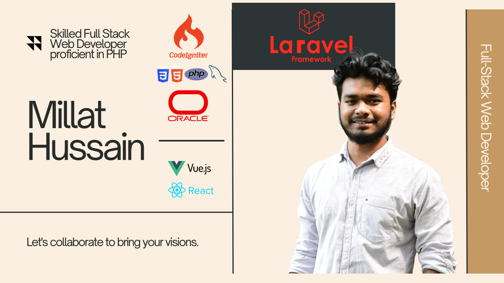

<h1 align="center">Hi 👋, I'm Millat Hussain</h1>
<h3 align="center">Full-Stack Web Developer</h3>

  

  

  

- 🔭 I’m currently working on **Laravel 9 , React Js**

- 🌱 I’m currently learning **Rest API**

- 👯 I’m looking to collaborate on **React-Landing Page**

- 🤝 I’m looking for help with **Web Development Sector**

- 📝 I regularly write articles on [millathussain.com](millathussain.com)

- 📫 How to reach me **millathussain127166@gmail.com**

<h3 align="left">Connect with me:</h3>

<h3 align="left">Languages and Tools:</h3>

                  

&nbsp;

